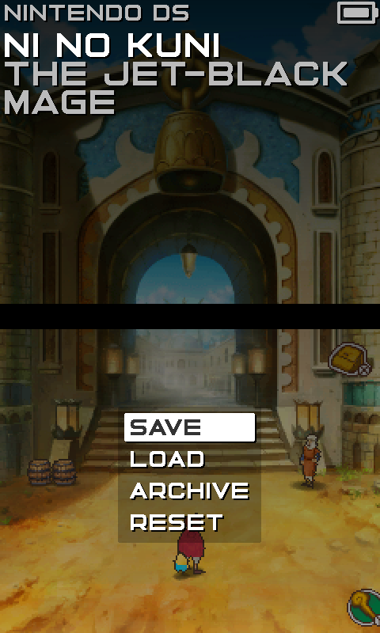
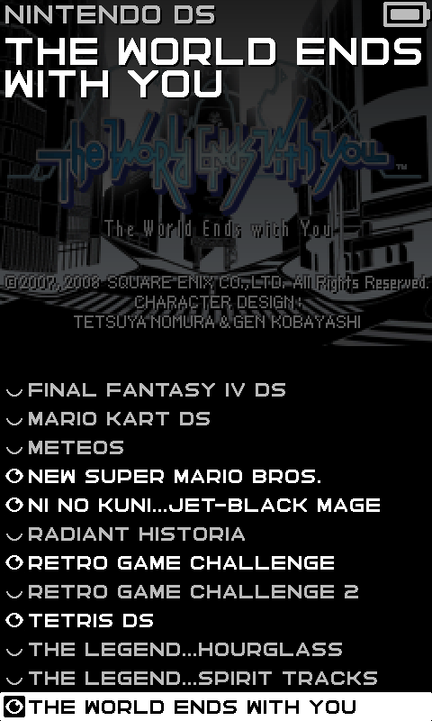
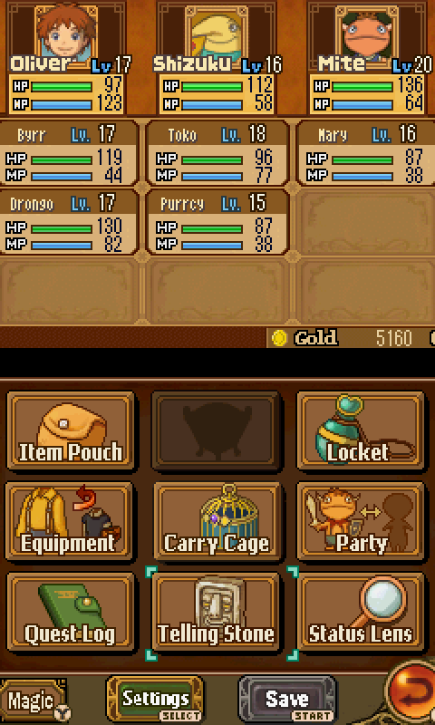
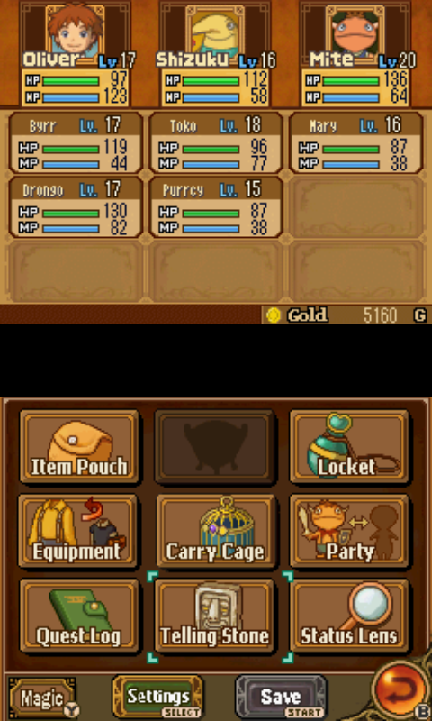

# Dedicated OS

DEDICATED OS is a cluster of hyper-focused, single system launchers for specific devices. This version is for playing Nintendo DS on the MagicX Zero40.

This is what it looks like.

  

That's it. DEDICATED OS integer scales and crops the overscan on the MagicX Zero40. This shaves off 8 source pixels from either side of the screen but produces a much sharper, much larger image.

  
